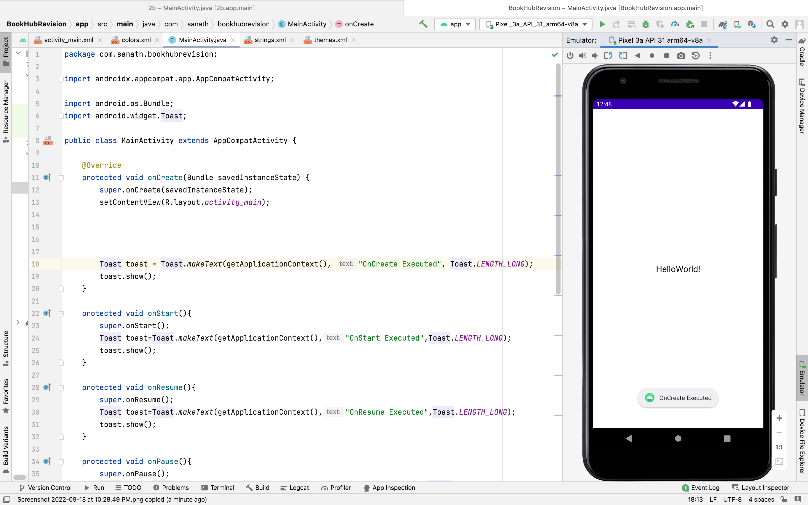
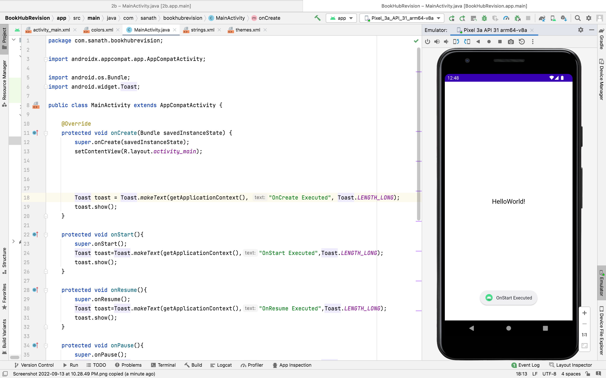
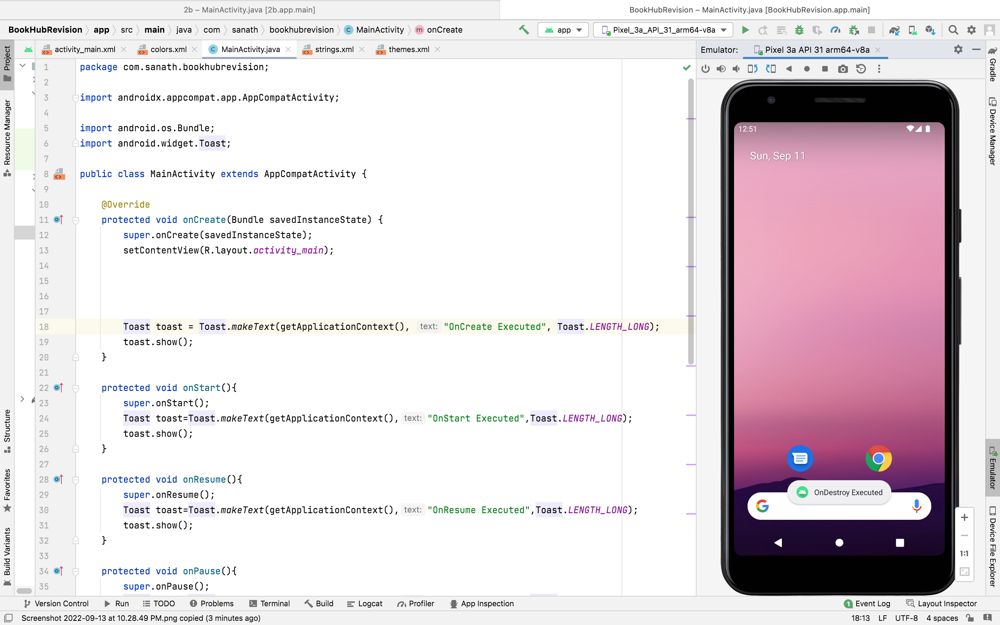

# Basic-AndroidStudio
~~~
Developed: Koduru Sanath Kumar Reddy
Registered Number: 212221240024
~~~
# MainActivity.java
~~~
package com.sanath.lifecycle;

import androidx.appcompat.app.AppCompatActivity;

import android.os.Bundle;
import android.widget.Toast;

public class MainActivity extends AppCompatActivity {

    @Override
    protected void onCreate(Bundle savedInstanceState) {
        super.onCreate(savedInstanceState);
        setContentView(R.layout.activity_main);

        Toast toast = Toast.makeText(getApplicationContext(), "OnCreate Executed", Toast.LENGTH_LONG);
        toast.show();
    }

    protected void onStart(){
        super.onStart();
        Toast toast=Toast.makeText(getApplicationContext(),"OnStart Executed",Toast.LENGTH_LONG);
        toast.show();
    }

    protected void onResume(){
        super.onResume();
        Toast toast=Toast.makeText(getApplicationContext(),"OnResume Executed",Toast.LENGTH_LONG);
        toast.show();
    }

    protected void onPause(){
        super.onPause();
        Toast toast=Toast.makeText(getApplicationContext(),"OnPause Executed",Toast.LENGTH_LONG);
        toast.show();
    }

    protected void onStop(){
        super.onStop();
        Toast toast=Toast.makeText(getApplicationContext(),"OnStop Executed",Toast.LENGTH_LONG);
        toast.show();
    }

    protected void onRestart(){
        super.onRestart();
        Toast toast=Toast.makeText(getApplicationContext(),"OnRestart Executed",Toast.LENGTH_LONG);
        toast.show();
    }

    protected void onDestroy(){
        super.onDestroy();
        Toast toast=Toast.makeText(getApplicationContext(),"OnDestroy Executed",Toast.LENGTH_LONG);
        toast.show();
    }
}

~~~
# activity_main.xml
~~~
<?xml version="1.0" encoding="utf-8"?>
<RelativeLayout xmlns:android="http://schemas.android.com/apk/res/android"
    xmlns:app="http://schemas.android.com/apk/res-auto"
    xmlns:tools="http://schemas.android.com/tools"
    android:layout_width="match_parent"
    android:layout_height="match_parent"
    tools:context=".MainActivity">
    <TextView
        android:layout_width="wrap_content"
        android:layout_height="wrap_content"
        android:text="HelloWorld!"
        android:layout_centerVertical="true"
        android:layout_centerHorizontal="true"
        android:textSize="20sp"
        android:textColor="@color/black"

        />
</RelativeLayout>
~~~
# Output

# Result

Therefore a program is return to develop a program to detect the various life cycles of an activity. The program is successfully executed. 
